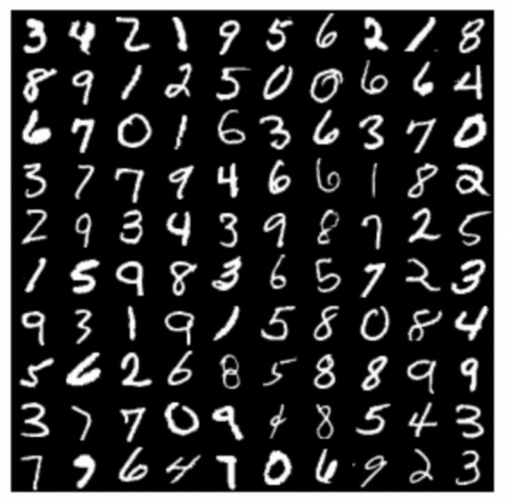

## 一、 背景介绍
MNIST 手写数字数据集是机器学习领域中广泛使用的图像分类数据集。它包含 60,000 个训练样本和 10,000 个测试样本。这些数字已进行尺寸规格化,并在固定尺寸的图像中居中。每个样本都是一个 784×1 的矩阵,是从原始的 28×28灰度图像转换而来的。MNIST 中的数字范围是 0 到 9。下面显示了一些示例。 

## 二、实验目的
本次案例中,用 python 实现 Softmax 回归方法,用于 MNIST 手写数字数据集分类任务。
* 记录训练和测试的准确率。画出训练损失和准确率曲线;
* 比较使用和不使用 momentum 结果的不同,可以从训练时间,收敛性和准确率等方面讨论差异;
* 调整其他超参数,如学习率,Batchsize 等,观察这些超参数如何影响分类性能;
* 注意代码的执行效率,尽量不要使用 for 循环
* 不使用任何深度学习框架,如 TensorFlow,Pytorch 等。

## 三、评价指标
* Accuracy 准确率: 分类正确的样本数除以总样本数。

## 四、实验过程
具体见 train.ipynb   

## 五、不足和思考
* 对数据集进行消除噪音的处理。如使用主成份提取法、或是图片降噪和清晰化方面。
* 随着迭代次数增加和收敛速度变慢后控制学习率衰减,减小训练成本,也更容易找到更合适的模型参数。

***
***

## 环境参考：

| model | version |
|----------|----------|
| python                    | 3.10.13 |
| matplotlib                | 3.4.3 |
| numpy                     | 1.22.3 |
| pandas                    | 1.5.3 |

## 文件清单如下:
| file/folder | remark |
|----------|----------|
|   data/               | 存放 MNIST 数据集。数据为 *ubyte 形式 |
|   img/                | train.ipynb 中显示用到的图片 |
|   dataloader.py       | 实现了数据加载器,用于准备数据以进行训练和测试 |
|   loss.py             | 实现 softmax_cross_entropy_loss,包含 loss 的计算和梯度计算 |
|   optimizer.py        | 实现带 momentum 的 SGD 优化器,可用于执行参数更新 |
|   solver.py           | 实现了训练和测试的流程 |
|   train.ipynb         | 完成所有代码后的执行文件,执行训练和测试过程 |
|   visualize.py        | 实现了 plot_loss_and_acc 函数,该函数用于绘制损失和准确率曲线 |