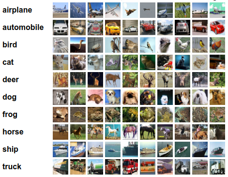

## 一、 背景介绍
CIFAR-10数据集是8000万微小图片的标签子集，由Alex Krizhevsky、Vinod Nair和Geoffrey Hinton收集。

CIFAR-10数据集由60000万张32*32的彩色图片组成，其中有50000张训练图片及10000张测试图片。一共有10个类别。每个类别6000张图片。数据集被划分为5个训练块和1个测试块，每个块10000张图片。

测试块包含了1000张从每个类别中随机选择的图片。训练块包含随机的剩余图像，但某些训练块可能对于一个类别的包含多于其他类别，训练块包含来自各个类别的5000张图片。这些类是完全互斥的，及在一个类别中出现的图片不会出现在其它类中。

下图就是列举了10各类，每一类展示了随机的10张图片：

## 二、实验目的

* 使用PyTorch分别实现多层感知机(MLP)和卷积网络(ConvNet)，并完成CIFAR10数据集分类；
* 自行配置网络和选取超参数，包括层数、卷积核数目、激活函数类型、损失函数类型、优化器等方面；
* 详细介绍所使用的模型及其结果，包括超参数选取，损失函数、准确率及其曲线；
* 从层数、卷积核数目、激活函数类型、损失函数类型和优化器待方面作比较和不同模型配置下的结果。

## 三、评价指标
* Accuracy 准确率: 分类正确的样本数除以总样本数。

## 四、实验过程
具体见 train.ipynb   

## 五、实验结果
最佳：
* mode                          DenseNet
* layer_count            [6, 12, 24, 16]
* epoch                               28
* batch_size                          16
* active_function                   ReLU
* loss_function         CrossEntropyLoss
* optimizer_function                 SGD
* lr                            0.000031
* weight_decay                    0.0001
* time                         92.192072
* loss_train                    0.128567
* loss_validate                 0.364503
* acc_train                     0.958625
* acc_validate                    0.8876
* acc_test                             0

其它结果具体见 train.ipynb   

## 六、不足
以下三点非常遗憾未深入观测：
* 原计划中要对卷积核数目和损失函数MSELoss对结果的影响未完成。
* 对超参数的观测也只是根据经验进行了初步尝试，未调到整体最优。
* DenseNet从结果上来看，对似合现象比较严重。
***
***
## 环境参考：

| model | version |
|----------|----------|
| python                    | 3.10.13 |
| matplotlib                | 3.4.3 |
| numpy                     | 1.22.3 |
| pandas                    | 1.5.3 |
| Pytorch                   | 1.13.0|
| Pytorch-cuda              | 11.7|
| VIDIA-Driver              | 515.86.01  | 
| NVIDIA-CUDA               | 11.7 	 | 
