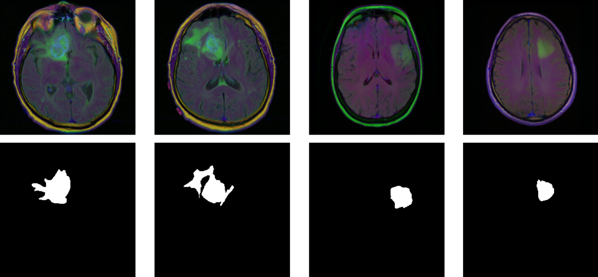
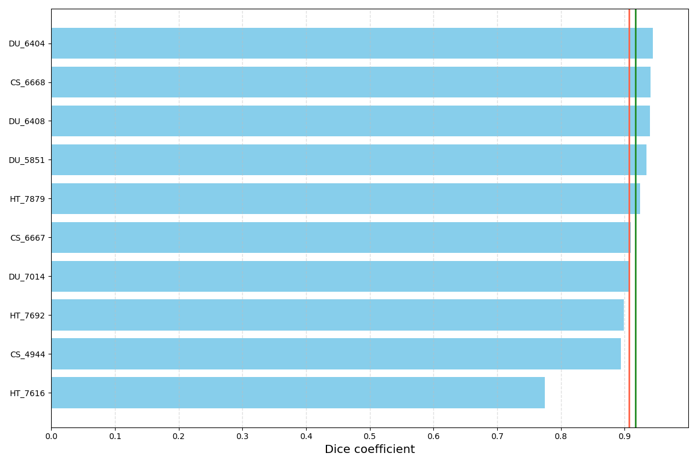

## 一、背景介绍
本次案例将使用深度学习技术来完成脑部MRI(磁共振)图像分割任务，即对于处理好的一张MRI图像，通过神经网络分割出其中病变的区域。本次案例使用的数据集来自Kaggle( https://www.kaggle.com/mateuszbuda/lgg-mri-segmentation)，共包含110位病人的MRI数据，每位病人对应多张通道数为3的.tif格式图像，其对应的分割结果为单通道黑白图像(白色为病变区域)，示例如下:

本次案例参考程序，来源于Kaggle（https://www.kaggle.com/mateuszbuda/brain-segmentation-pytorch）和GitHub(https://github.com/mateuszbuda/brain-segmentation-pytorch)。各个程序简介如下：
* ltrain.ipynb用来完成模型训练
* linference.ipynb用来对训练后的模型进行推理
* lunet.py定义了U-Net网络结构，参考资料[5]
* lloss.py定义了损失函数(Dice Loss)，参考资料[6]
* ldataset.py用来定义和读取数据集
* ltransform.py用来预处理数据
* lutils.py定义了若干辅助函数
* llogger.py用来记录训练过程，包括损失函数曲线等

## 二、实验目的
* 在参考程序的基础上，使用深度学习技术，尝试提升该模型在脑部MRI图像上的分割效果，以程序最终输出的validation mean DSC值作为评价标准(参考程序约为90%)。可从网络结构(替换U-Net)、损失函数(替换Dice Loss)、训练过程(如优化器)等角度尝试改进，还可参考通用图像分割的一些技巧；
* 详细介绍所有改进尝试及对应的结果(包括DSC值和若干分割结果示例)，无论是否成功提升模型效果，并对结果作出分析；

## 三、改进思路
观测默认程序初步小结如下：
* epoch 取到100的意义不大。DSC在20次内就取得了最佳，Loss的下降也在30已趋向收敛。在后面的调参中，结合时间复杂度，取30左右相对合理。
* Loss的下降幅度和收敛从曲线表现上来看还不错。可以考虑暂时就用0.0001的学习率。但可以尝试加入学习率衰减。

 实验过的程度见train_default.ipynb

### 3.1尝试不同的损失函数
默认损失函数使用 DiceLoss。以之相似的还有IOULoss，考虑加入对比。然后在查阅《用于医学图像分割的损失函数》（https://zhuanlan.zhihu.com/p/267128903），发现Focal Tversky Loss效果可能也还行。考虑再加入实验。
### 3.2尝试不同的优化器
SGD+momentum(momentum取0.9， 0.99),Adam下不同的效果
### 3.3尝试不同的权重衰减系数
加入权重衰减系数并没有像预期中取得更好的效果。是因为权重衰减系数取得不对？在取值为0.0003时Loss下降得更快，效果反倒是最差；在取值为0.0001时Loss下降得更慢，效果也不行。取0.0002更合理？
### 3.4尝试不同的网络模型
在尝试UNet++和UNet3+时，总是显存内存溢出。尝试把默认的filters = [64, 128, 256, 512, 1024] 更改为[32, 64, 128, 256, 512]，也试过调整不同的学习率、损失函数和优化器相关参数，都没有解决。因时间关系，只能暂时放弃。
### 3.5尝试是否使用学习率衰减
在使用学习率衰减(学习率线性衰减区间[0.0001-0.00001])后，取到的更差的效果，这也是很让人费解的事。可能的原因：1.学习率衰减采用线性衰减的方法不对，其它如训练轮衰减可能更合理？2.初始学习率不恰当。

## 四、小结

| loss function| optimizer function| weight decay| use_lr scheduler| epoch| val loss| val_dsc| 
|----------|----------|----------|----------|----------|----------|----------|
| DiceLoss| Adam| 0| FALSE| 13| 0.471045| 0.914145| 
| FocalTverskyLoss| Adam| 0| FALSE| 13| 0.432721| 0.911195| 
| IOULoss| Adam| 0| TRUE| 15| 0.729897| 0.911171| 
| IOULoss| Adam| 0| TRUE| 16| 0.723833| 0.911064| 
| FocalTverskyLoss| Adam| 0.0001| TRUE| 16| 0.544836| 0.910915| 
| IOULoss| Adam| 0| TRUE| 21| 0.700946| 0.910900| 
| IOULoss| Adam| 0| TRUE| 17| 0.714410| 0.910774| 
| FocalTverskyLoss| Adam| 0| FALSE| 15| 0.402925| 0.910497| 
| IOULoss| Adam| 0| TRUE| 19| 0.707320| 0.910455| 
| IOULoss| Adam| 0| TRUE| 20| 0.703345| 0.910364| 

示例：

本次案例试验，尝试了不同的损失函数、优化器、权重衰减和学习率衰减等参数对结果的影响，对不同的超参及如何调优进一步加深了认识。同时，对医学图像的语义分割也有了初步的体会，对基于FCN的Unet也充分体会到其简单、高效、易懂、容易构建的特点。

从最终评价指标上来说本次案例试验做得并不满意，没有找到最合适的超参数和方法。

### 主要不足以下：
* UNet++和UNet3+预计效果会比Unet好得多，但未成功加进对比。
* 在调参过程中，没有及时保存中间一些取值还不错的pytorch模型。倒导新的训练时把结果模型覆盖。而本案例实验数据集不大引起的波动很大，要重现模型时间成本非常高；
* 本来还想尝试更换其它的激活函数、把batch_size从16改为8或32。时间问题，后面再继续

***
***
## 环境参考：
| model | version |
|----------|----------|
| CPU| 	Intel(R) Core(TM) i7-10700 CPU @ 2.90GHz|
| GPU| 	NVIDIA GeForce RTX 3070|
| OS| 		Linux Mint 21.1 Cinnamon|
| NVIDIA-Driver|  515.86.01   |
| NVIDIA-CUDA|  11.7 |	   
| Python|  		3.7.15 	|
| Pytorch| 		1.13.1|
| Pytorch-cuda|  11.6|
| numpy| 		1.21.5  |
| tensorflow| 	2.2.0|
| scikit-image| 	0.14.2    |      
| scikit-learn| 	0.20.3 	|
| imageio| 		2.5.0    |                
| medpy| 		0.4.0   |         
| pandas| 		1.3.5    |       
| pillow| 			6.0.0  | 
| scipy| 			1.4.1  |
|tqdm| 			4.64.1|

## 文件说明：
* unet_layers.py、unet_init_weights.py、unet_2plus.py、unet_3plus.py：unet++、unet3+的实现； 
* utrain_default.ipynb: 原代码和框架直跑文件；
* utrain.ipynb: 6.1-6.5对应的训练代码和过程；
* result/uexec_result_train.csv：6.1-6.5中训练和调参过程的详细参数及对应结果；
* train_best.ipynb: 6.6对应的训练代码和过程；
* result/uexec_result_best.csv：6.6中训练和调参过程的详细参数及对应结果。

