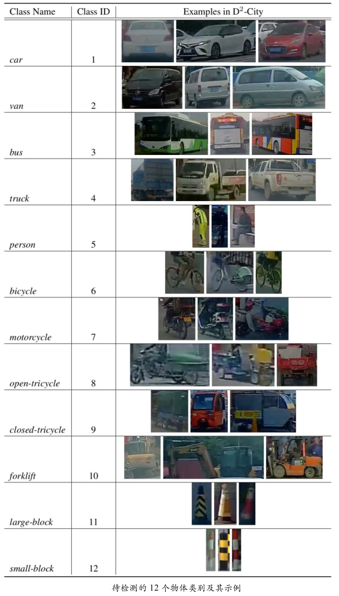
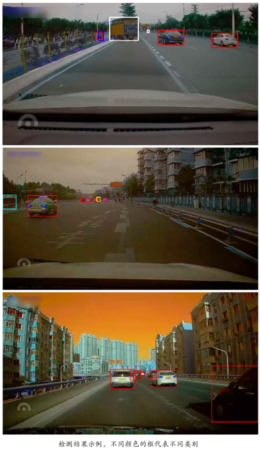
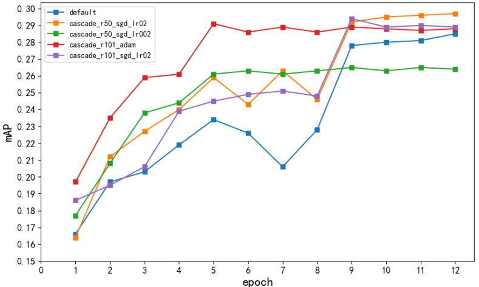
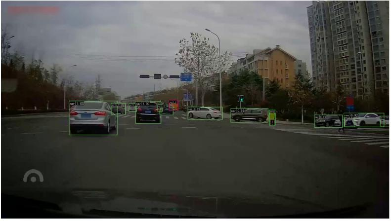

## 一、背景介绍
目标检测是计算机视觉领域内一个长期存在的基础性难题，几十年来也一直都是一个活跃的研究领域。目标检测的目标是确定某张给定图像中是否存在给定类别（比如人、车、自行车、狗和猫）的目标实例；如果存在，就返回每个目标实例的空间位置和覆盖范围（比如返回一个边界框 ）。作为图像理解和计算机视觉的基石，目标检测是解决分割、场景理解、目标追踪、图像描述、事件检测和活动识别等更复杂更高层次的视觉任务的基础。目标检测在人工智能和信息技术的许多领域都有广泛的应用，包括机器人视觉、消费电子产品、安保、自动驾驶、人机交互、基于内容的图像检索、智能视频监控和增强现实。

本次案例将使用深度学习技术来完成城市交通场景下的目标检测任务,案例所使用的数据集由滴滴出行提供，基于 D2-City 大规模行车记录视频数据集，经过视频抽帧等预处理步骤得到。数据集共包含 12,000 张图像，每张图像的大小为 1080×1920 或 720×1280，已划分为训练集(10,000 张)、验证集(1,000 张)、测试集(1,000 张)，其中训练集和验证集提供了检测标签，测试集仅提供图像,用于提交后测试模型效果。本数据集共包含 12 个待检测的物体类别，包括小汽车、公交车、自行车、行人等，具体定义及示例如下面左图所示。本任务的目标是在给定的交通场景图像中，尽可能完整、准确地检测出所有要求的物体,检测结果示例如下图所示。
| | |
|----|----|
|  |  |

案例提供参考程序(以Faster R-CNN with FPN为例)：
* didi_demo.ipynb
* didi_detection.py
* faster_rcnn_r50_fpn_1x_didi.py

## 二、实验目的
* 在参考程序的基础上,综合使用深度学习各项技术,尝试提升该模型在城市
交通场景目标检测任务上的效果，以最后提交的.json 输出结果对应的测试集mAP 值为评价标准；
* 案例报告应详细介绍所有改进尝试及对应的结果(包括验证集 mAP 值和若干检测结果示例图)，无论是否成功提升模型效果,并对结果作出分析;
* 提交 test_results.json 文件。

## 三、实验环境
| model | version |
|----------|----------|
|CPU | 			Intel(R) Core(TM) i7-10700 CPU @ 2.90GHz|
|GPU | 			NVIDIA GeForce RTX 3070|
|NVIDIA-Driver |  515.86.01   |
|NVIDIA-CUDA |  11.7 	   |
|OS | 				Linux Mint 21.1 Cinnamon|
|nvcc | 			11.7.99|
|gcc | 			11.3.0|
|python |  		3.9.15 	|
|torch | 			1.13.1+cu117|
|torchaudio | 	0.13.1+cu117|
|torchvision | 	0.14.1+cu117|
|mmcv-full | 		1.7.1   |
|mmdetection | 	2.27.0  |

 mmdetection/mmdet目录下文件太多太大，也没有改动没上传，请自行官网下载。

## 四、默认程序结果
注释默认程序didi_detection.py中重复定义的model，把model里面定义的输出分类类别数量12，当运行时的配置参数通过cfg-options传入。即可运行。

## 五、改进思路
* 观测上面默认程序的mAP趋势图，epoch 取到12次后的意义不大。
* 默认配置下，faster_rcnn_r50_fpn.py中定义ratios为[0.5, 1.0, 2.0]，针对本数据集的12种分类，anchor的设置可能不合理。首先要尝试改进anchor。
* 默认配置下，Faster R-CNN with FPN使用的是ResNet 50，理论上ResNet 101效果应该更好，必须尝试。
* 默认使用Faster R-CNN with FPN，可能不是最佳的检测算法。尝试使用Cascade R-CNN，同时，对You Only Look Once也很感兴趣，尝试加入YOLOX作对比。
* 默认配置下，优化器中schedule_1x使用SGD，尝试更改为Adma。同时观测不同学习率带来的影响。

## 六、改进过程和对比结果
6.1改进anchor
详细代码和训练过程见文件《2.train_faster_rcnn_r51_anchor.ipynb》
6.2替换ResNet 50为ResNet 101
详细代码和训练过程见文件《3.train_faster_rcnn_r101.ipynb》。
6.3使用Cascade R-CNN
详细代码和训练过程见文件《4.train_cascade_rcnn_r101.ipynb》。
6.4使用YOLOX
YOLOX的训练有些问题。后面会上YOLO v8/v9 的版本
6.5最佳模型及结果
 |
本次实验的最佳模型为Cascade R-CNN（ResNet 50）。最佳mAP为2.97。但因为训练结果出具较早，被后继覆盖。推理和测试只能选用还保留的模型ResNet 101。取测试集第一张图片，识别如下：
 |
具体预测文件，见text_results.json

## 七、总结和思考
* 网络层度的深浅必须结合不同的数据集和任务、模型来比较，并不是所有使用ResNet的模型，越深就越好。如101就不一定会比ResNet 50好。
* YOLOX的因为错误的学习率设置没有取到好的效果，根本原因在于没有及时观察Loss和LR变化而调整训练。训练的过程，必须高度重视Loss和LR的输出。
* MMDetection很强大很方便，但出问题后，文档吃不透会很难解决。特别是用于生产环境中，须得进一步深入学习、研究和实践。
* 训练过程的时间永远不够。一方面是实验的中后期思路不够清晰，浪费了大量时间；二是深深地体会到必须用强大的显卡算力来换时间的必要性。
