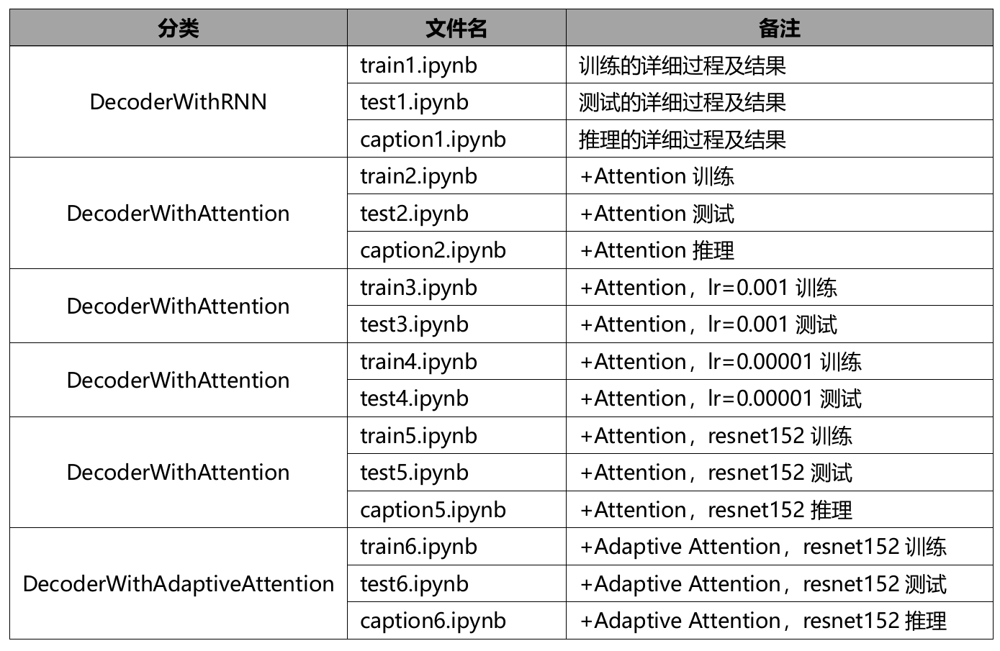
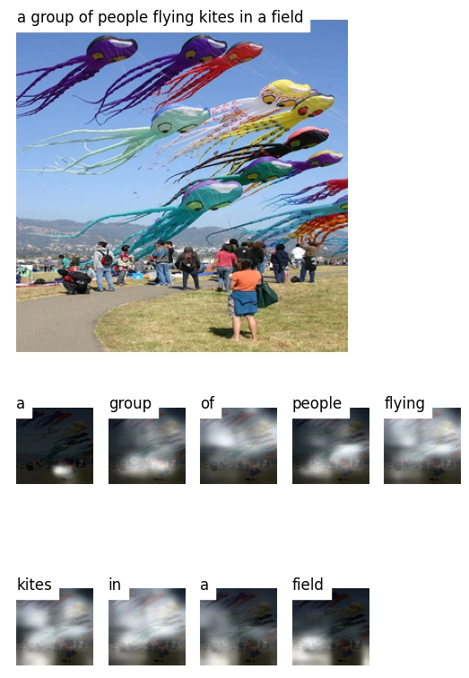

## 一、背景介绍
本次案例将使用深度学习技术来完成图像自然语言描述生成任务，输入一张图片，模型会给出关于图片内容的语言描述。本案例使用 coco2014 数据集[1]，包含 82783 张训练图片，40504 张验证图片，40775 张测试图片。案例使用 Andrej Karpathy[2]提供的数据集划分方式和图片标注信息，案例已提供数据处理的脚本，只需下载数据集和划分方式即可。

图像自然语言描述生成任务一般采用 Encoder-Decoder 的网络结构，Encoder采用 CNN 结构，对输入图片进行编码，Decoder 采用 RNN 结构，利用 Encoder编码信息，逐个单词的解码文字描述输出。模型评估指标采用 BLEU 分数[3]，用来衡量预测和标签两句话的一致程度。

本次案例提供了完整、可供运行的参考程序，各程序简介如下:
*  create_input_files.py : 下载好数据集和划分方式后需要运行该脚本文件，会生成案例需要的 json 和 hdf5 文件，注意指定输入和输出数据存放的位置。
*  datasets.py : 定义符合pytorch标准的Dataset类，供数据按Batch 读入。
*  models.py : 定义Encoder和Decoder网络结构，其中Encoder已提前定义好，无需自己实现。两种 Decoder 方法需要自行实现，已提供部分代码，只需将 #ToDo 部分补充完全即可。
*  solver.py : 定义了训练和验证函数，供模型训练使用。
*  train.ipynb : 用于训练的 jupyter 文件，其中超参数需要自行调节，训练过程中可以看到模型准确率和损失的变化，并可以得到每个 epoch 后模型在验证集上的 BLEU 分数，保存最优的验证结果对应的模型用于测试。
*  test.ipynb : 用于测试的 jupyter 文件，加载指定的模型，解码时不使用 teacher forcing，并使用 beam search 的解码方法，最终会得到模型在测试集上的 BLEU分数。
*  caption.ipynb : 加载指定模型，对单张输入图片进行语言描述，第一种Decoder 方法只能得到用于描述的语句，第二种 Decoder 方法同时可以获取每个单词对应的注意力权重，最后对结果进行可视化。
* utils.py : 定义一些可能需要用到的函数，如计算准确率、图像可视化等。

## 二、实验目的
* 调节超参数，运行 train.ipynb，其中 attention 参数指示使用哪种 Decoder，分别训练使用两种不同 Decoder 的模型，可以分两个 jupyter 文件保存最佳参数和训练记录，如 train1.ipynb， train2.ipynb;
* 运行 test.ipynb 得到两个模型在测试集上的 BLEU 分数，分别保留结果;
* 选择一张图片，可以是测试集中的，也可以是自行挑选的，对图片进行语言描述自动生成，分别保留可视化结果;
* 在参考程序的基础上，综合使用深度学习各项技术，尝试提升该模型在图像自然语言描述生成任务上的效果，如使用更好的预训练模型作为 Encoder，或者提出更好的 Decoder 结构，如 Adaptive Attention 等;
* 完成一个实验报告，内容包括基础两个模型的实现原理说明、两个模型的最佳参数和对应测试集 BLEU 分数、两个模型在单个图片上的表现效果、自己所做的改进、对比分析两个基础模型结果的不同优劣。

## 三、实验环境
| model | version |
|----------|----------|
|CPU|			Intel(R) Core(TM) i7-10700 CPU @ 2.90GHz|
|GPU|			NVIDIA GeForce RTX 3070|
|NVIDIA-Driver| 515.86.01   |
|NVIDIA-CUDA| 11.7 	  | 
|OS|				Linux Mint 21.1 Cinnamon|
|python| 		3.9.15 	|
|torch|			1.13.1+cu117|
|torchaudio|	0.13.1+cu117|
|torchvision|	0.14.1+cu117|
|numpy|		1.19.5|
|nltk|			3.7|
|tqdm|			4.64.1|
|h5py|			3.1.0|
|json5|			0.9.6|
|matplotlib|		3.5.2|
|scikit-image|	0.19.2|
|scipy|			1.9.1|
|imageio|		2.19.3|
chardet|		4.0.0|

## 四、模型改进
* DecoderWithRNN测试、语言描述自动生成的详细过程及结果，分别见《test1.ipynb》、《caption1.ipynb》;
* DecoderWithAttention测试和语言描述自动生成的详细过程及结果，分别见《test2.ipynb》、《caption2.ipynb》；解码器初始学习率调整为0.001后训练、测试的详细过程及结果，见《train3.ipynb》、《test3.ipynb》；解码器初始学习率调整为0.00001后训练、测试的详细过程及结果，见《train4.ipynb》、《test4.ipynb》

 |

## 4.1编码器改进
默认的编码器使用ResNet101网络作为编码器，去除最后Pooling和Fc两层，并添加了AdaptiveAvgPool2d()层来得到固定大小的编码结果。编码器的改进方法有很多。本例中只尝试把ResNet101换为ResNet152

注：编码器调整为resnet152后的训练、测试详细过程及结果，分别见《train5.ipynb》、《test5.ipynb》

## 4.2解码器改进
详细原理和说明见《Knowing When to Look: Adaptive Attention via A Visual Sentinel for Image Captioning》https://arxiv.org/pdf/1612.01887.pdf

注：DecoderWithAdaptiveAttention的训练、测试和推理详细过程及结果，分别见《train6.ipynb》、《test6.ipynb》、《caption6.ipynb》、

## 五、结果对比
|模型和参数 | 验证集BLEU-4 | 测试集BLEU-4|
|----|----|----|
|DecoderWithRNN | 0.2176 | 0.2629|
|DecoderWithAttention | 0.2314 | 0.2775|
|DecoderWithAttention (lr=0.001)| 0.1841 | 0.2707|
|DecoderWithAttention (lr=0.00001)| 0.2261 | 0.2555|
|DecoderWithAttention (Resnet152) | 0.235 | 0.2827|
|DecoderWithAdaptiveAttention (Resnet152)| 0.2307 | 0.2665|

结果示例(DecoderWithAttention_Resnet152):
 |

## 七、总结和思考
后继可以从以下几点着手改进：
* 调低batch size。参考程序中默认值为32。实验的早期尝试过16和8，但可能因为本机环境的原因，都存在显未溢出的问题。后继为了缩短训练时间，把batch size调到了64。
* 减小dropout。参考程序中Dopout正则化默认值为0.5。可以减小到0.4-0.2的区间观测。
* 更改隐藏层神经元的数量和解码器的初始学习率。

对于使用Adaptive Attention机制没有了取到比Attention更好的效果，最可能存在以下三个原因：
* Adaptive Attention的代码实现还有问题。
* 使用Resnet152不合理，可能更浅的Resnet101更适配。
* 没有找到最佳的解码器初始学习率。