## 一、背景介绍
本次案例将使用生成对抗网络来实现4 倍图像超分辨任务，输入一张低分辨率图像，生成器会生成一张4 倍超分辨率的图像，如图1 所示。生成对抗网络选用SRGAN 结构[1]。本案例训练集使用DIV2K 数据集[2]，包含有800 张2K 左右高分辨率的图像和800 张对应的低分辨率图像；测试集使用DIV2K 验证集[2]、Set5、Set14、B100、Urban100 五个数据集，分别包括高分辨率图像和对应的低分辨率图像。训练集和测试集中的所有低分辨图像都是由高分辨率图像下采样得到，下采样方法为使用Matlab 中的resize 函数，scale factor 为0.25，其余为默认参数（双三次插值）。
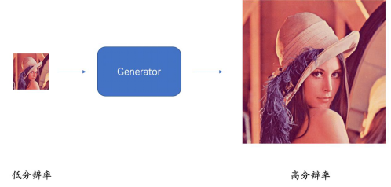

参考程序，简介如下:
* create_data_lists.py : 下载好训练集和测试集后，根据提供的数据集地址来生成案例训练测试所需要的csv 文件。
* datasets.py : 定义符合pytorch 标准的Dataset 类，供读入数据，注意训练阶段每张图片采样了100 个patch 来扩充训练集。
* imresize.py : 用python 实现了matlab resize 函数，用于图像下采样。
* solver.py : 定义了一个epoch 的训练过程。
* models.py : 定义SRGAN 模型结构，需要自行实现。
* train.ipynb : 用于训练的jupyter 文件，其中超参数需要自行调节，训练过程中可以看到模型损失的变化，每个epoch 训练后都会进行模型保存。
* est.ipynb : 加载指定的训练好的模型文件，在5 个测试集上进行测试，计算并报告各个数据集上的PSNR 和SSIM 指标数值。
* super_resolution.ipynb : 加载指定的训练好的模型文件，针对单个图片进行4倍超分辨，并对结果进行可视化。
* utils.py : 定义了一些可能会用到的函数，如图像数值格式转换等。

## 二、实验目的
本案例使用PSNR 与SSIM 两个评价指标来衡量生成的高分辨率图像的质量，但指标的高低并不能直接反应图像质量的好坏，因此最终结果评价会加入人工评价。
* 完成models.py 文件。参考原论文: Ledig, Christian, et al. "Photo-realistic single image super-resolution using agenerative adversarial network." Proceedings of the IEEE conference on computer vision and pattern recognition. 2017. https://arxiv.org/abs/1609.04802；
* 调节train.ipynb 中的超参数，使网络结构与原论文保持一致。运行train.ipynb使案例可以跑通基础模式的训练；
* 设计生成器和判别器的训练方式，参考https://github.com/tensorlayer/srgan中的训练方式，修改solver.py 和train.ipynb 训练出性能更好的模型；
* 运行test.ipynb 对模型在5 个测试集上进行测试，记录PSNR 与SSIM 结果；
* 运行super_resolution.ipynb，为Set5 测试集中的每一张低分辨图片生成相应的高分辨图片，保留结果供人工评价

## 三、实验环境
| model | version |
|----------|----------|
|CPU | 			Intel(R) Core(TM) i7-10700 CPU @ 2.90GHz|
|GPU | 			NVIDIA GeForce RTX 3070|
|NVIDIA-Driver |  515.86.01   |
|NVIDIA-CUDA |  11.7 	   |
|OS | 				Linux Mint 21.1 Cinnamon|
|nvcc | 			11.7.99|
|gcc | 			11.3.0|
|python |  		3.9.15 	|
|torch | 			1.13.1+cu117|
|torchaudio | 	0.13.1+cu117|
|torchvision | 	0.14.1+cu117|
|numpy | 		1.19.5 |
|tqdm | 			4.64.1 |
|matplotlib | 		3.5.2 |
|scikit-image | 	0.19.2 |
|chardet | 		4.0.0 |
|easydict | 		1.9 |

## 四、SRGAN
SRGAN网络结构，和其他对抗生成网络一样，SRGAN有生成网络和判别网络。SRGAN的原论文发表于CVPR2017，即《Photo-Realistic Single Image Super-Resolution Using a Generative Adversarial Network》。详细参见http://arxiv.org/abs/1609.04802。

### 4.1 生成网络
生成网络的结构
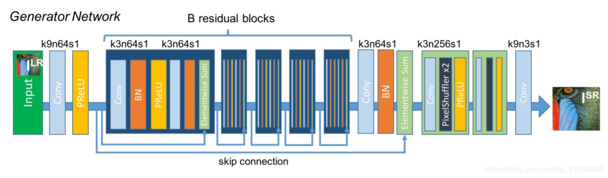
训练的过程
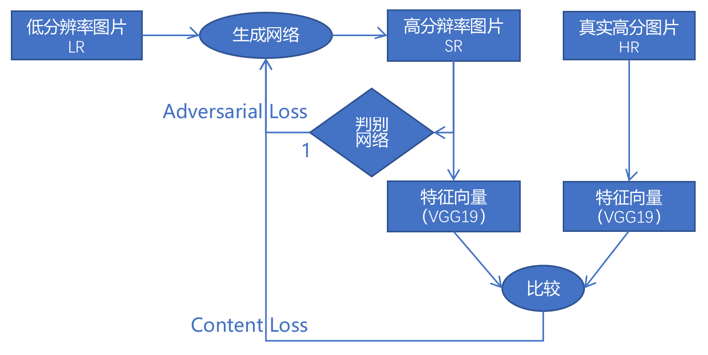

### 4.2 判别网络
判别网络的结构
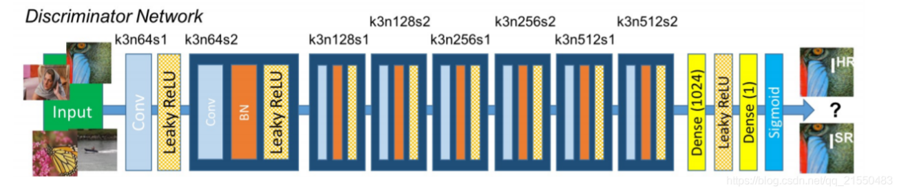
训练的过程
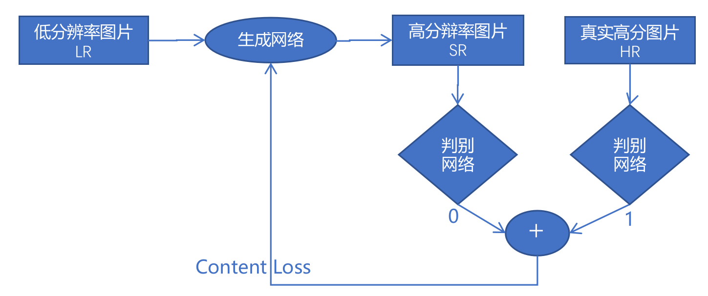

## 五、改进思路
生成器上加入预训练过程

## 六、过程和结果
### 6.1 训练过程和文件说明
|文件名 | 备注|
|---|---|
|train1.ipynb | 默认参数下的训练过程及结果|
|train 1_loss.csv | 默认参数下的训练过程的Loss整理|
|super_resolution 1 Set5.ipynb | 默认模型在Set5测试集上生成的图片效果对比|
|super_resolution 1 Set14.ipynb | 默认模型在Set14测试集上生成的图片效果对比|
|test 1.ipynb | 默认模型在5个测试集上的2PSNR 和 SSIM 指标|
|test 1_50epoch.ipynb | 默认模型在5个测试集上，第50个epoch的2PSNR 和 SSIM 指标|
|train 2_0-99epoch pre.ipynb | 0-99个epoch专门用来作预训练|
|train 2_100-150epoch pre.ipynb | 100-150 个epoch。用来作训练|
|train 2_loss .csv | 加入预训练后的Loss结果整理|
|super_resolution 2 Set5.ipynb | 加入预训练后模型在Set5测试集上生成的图片效果对比|
|super_resolution 2 Set14.ipynb | 加入预训练后模型在Set14测试集上生成的图片效果对比|
|test 2.ipynb | 加入预训练后模型在5个测试集上，第50个epoch的2PSNR 和 SSIM 指标。|
### 6.2 Set5测试集生成图片效果
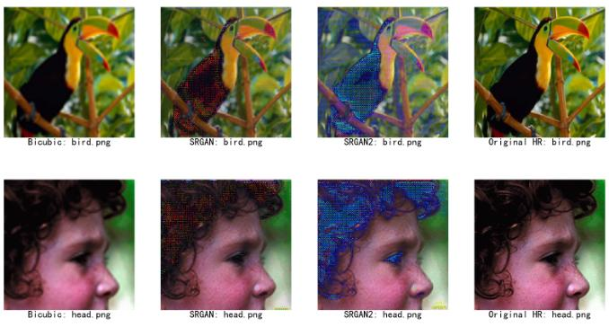
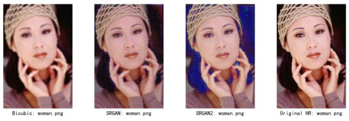
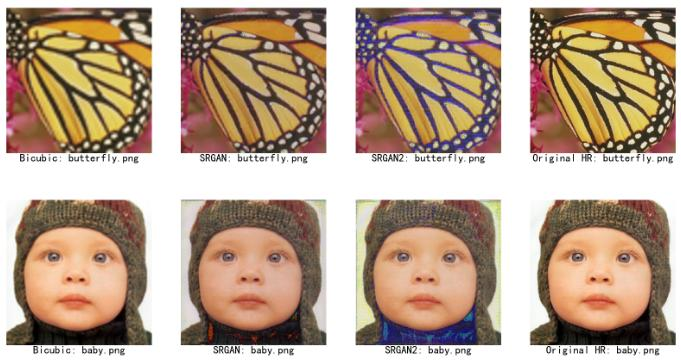
### 6.3 Set14测试集生成结果
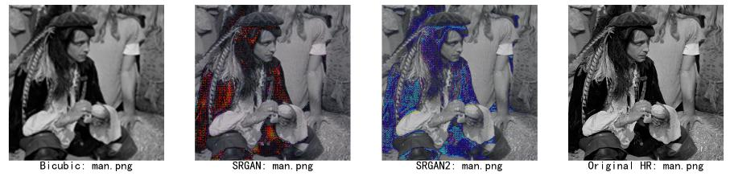
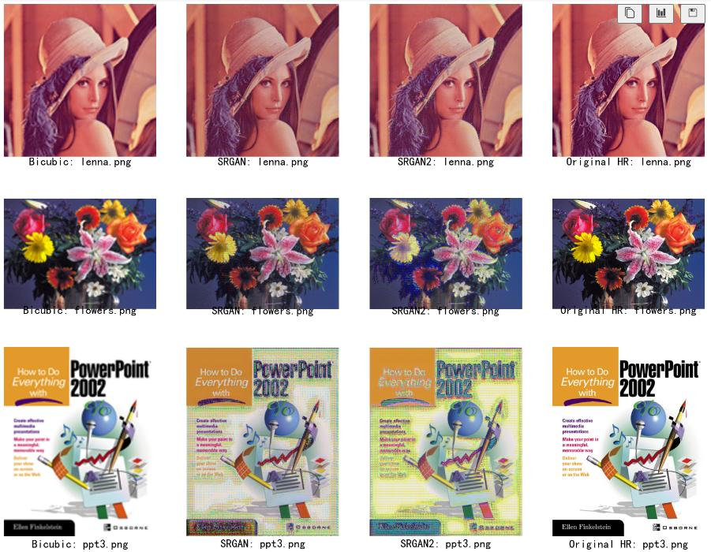
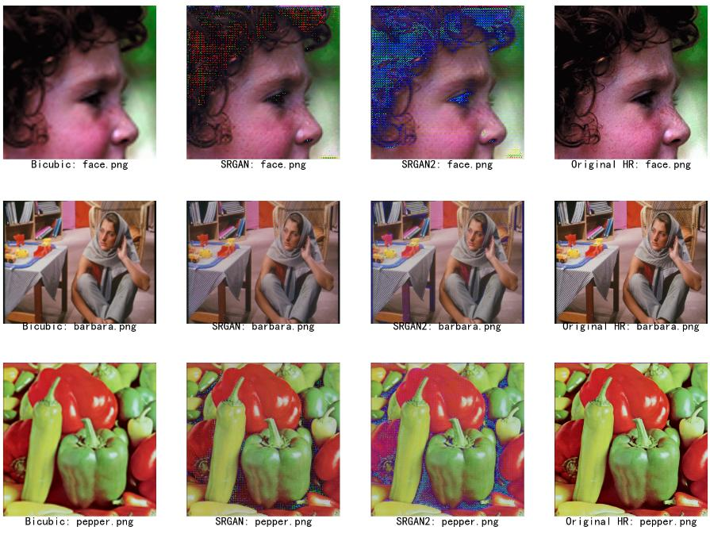
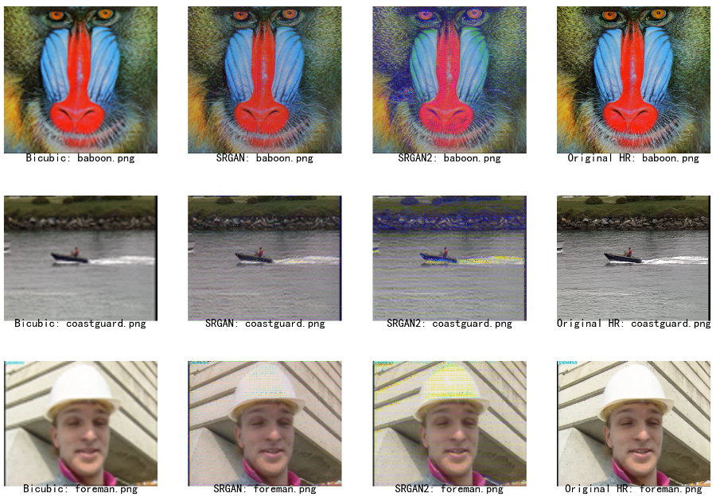
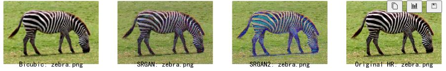
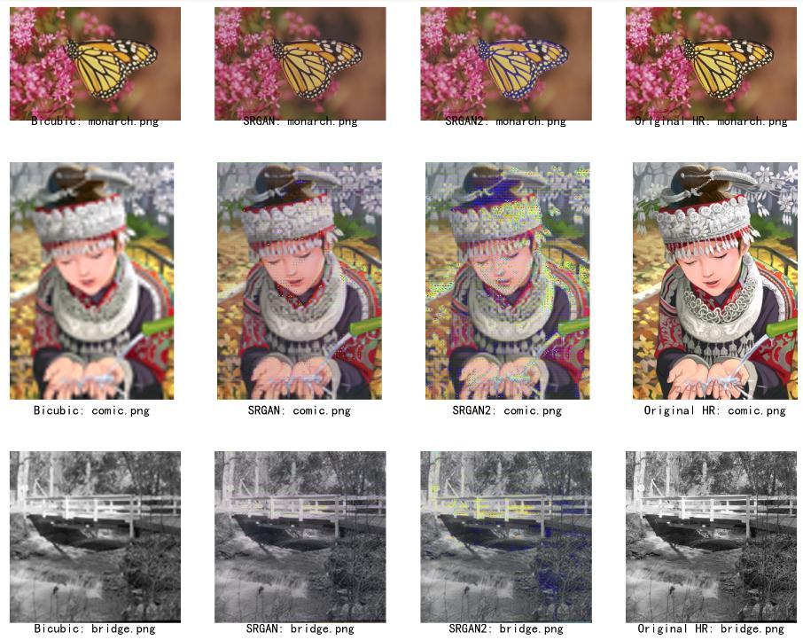

### 参考材料
1. Ledig, Christian, et al. "Photo-realistic single image super-resolution using a
generative adversarial network." Proceedings of the IEEE conference on computer
vision and pattern recognition. 2017. https://arxiv.org/abs/1609.04802
2. https://data.vision.ee.ethz.ch/cvl/DIV2K/
3. https://zhuanlan.zhihu.com/p/50757421
4. https://github.com/tensorlayer/srgan
